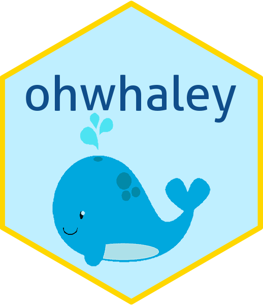

<!-- README.md is generated from README.Rmd. Please edit that file -->

# ohwhaley 

<!-- badges: start -->

[](https://github.com/fontikar/ohwhaley)
[](https://lifecycle.r-lib.org/articles/stages.html#experimental)
<!-- badges: end -->

Whale-come! This R package was inspired by
[cowsay](https://github.com/sckott/cowsay) and
[praise](https://github.com/rladies/praise). I hope this package made
you smile today!

## First things first

`ohwhaley` is a toy project and is still under development. You can
install the latest version from [GitHub](https://github.com/) with:

``` r
# install.packages("remotes")
remotes::install_github("fontikar/ohwhaley")
```

## Take it for a spin

`ohwhaley` contains one function only. `say()` will echo a randomly
chosen whale-themed phrase for your enjoyment.

``` r
library(ohwhaley)
 
say() 
#> 
#>             ------ 
#>            Get whale soon! 
#>             ------ 
#>                \   
#>                 \  
#>                  \
#>      .-'
#> '--./ /     _.---.
#> '-,  (__..-`       \
#>    \          .     |
#>     `,.__.   ,__.--/
#>      '._/_.'___.-`
```

Alternatively, you can supply your own phrase

``` r
say("I'm beached as bro!!!")
#> 
#>             ------ 
#>            I'm beached as bro!!! 
#>             ------ 
#>                \   
#>                 \  
#>                  \
#>      .-'
#> '--./ /     _.---.
#> '-,  (__..-`       \
#>    \          .     |
#>     `,.__.   ,__.--/
#>      '._/_.'___.-`
```
